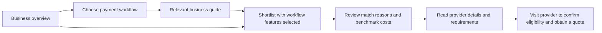

# Business journey redesign

30 September 2026. Scope: `/business`, `/business/compare`, and all four `/business/[slug]` guides.

## Journey and hierarchy

The landing page puts a concise purpose and one primary comparison action beside a data-derived cost visualization. Four workflow cards replace long generic introductions: everyday payments, suppliers, teams and larger transfers. Research links remain available in an expandable directory.

The comparison page puts the interactive finder before detailed evidence. Workflow presets select relevant features; users can adjust them, exclude Mercury for a company outside the US, reset selections and sort by feature match, measured benchmark cost or name. Results explain full and limited feature support, show measured average cost where available, and label missing price data “Quote needed.” Each result has a provider-specific action and a quieter details link. Matches do not establish eligibility or a personal quote.

The four guides use the same visual system, concise workflow introductions, mobile contents menus, desktop contents rails, expandable FAQs and links back to a comparison with the relevant features preselected. Existing article sections and supporting quote widgets are retained. The template no longer changes the Article modification date every time it renders.

## Commercial placement

A dedicated TapTap Send Business spotlight appears on the landing page, comparison page and guide template. It is explicitly labelled Sponsored and links directly to the business service. It is outside the six-provider scored shortlist and does not add an unmeasured cost or change rankings.

TapTap's business service and business FAQs were checked via its [official business site](https://business.taptapsend.com/) and [FAQ](https://business.taptapsend.com/faq). No personal-transfer quote is presented as a business quote, and no business affiliate commission is asserted.

## Evidence and content changes

- Removed the landing page's annual savings extrapolations from a single $5,000 benchmark to much higher monthly volumes.
- The visual benchmark is computed from the existing business FX index, with the tracked amount, route coverage, observation date and methodology link visible.
- The broader cost index and the six-profile feature comparison remain distinct datasets. Not all feature profiles have measured costs.
- Removed the “30 seconds” promise and the hero's “today” wording; displayed data dates are explicit.
- Replaced a FAQ answer that attributed operational features to whichever provider happened to lead the cost index.
- Replaced hover-only matrix detail with keyboard- and touch-operable disclosure cells. The wide matrix has a labelled, focusable scroll region.
- Feature details retain their June 2026 review date. The full legacy article and provider-feature inventory was not independently re-researched during this design work; users can inspect profile details and must confirm availability directly with providers.

Primary references consulted include [Wise's batch payment guide](https://wise.com/help/articles/2663240/guide-to-batch-payments) and [Airwallex's batch-transfer documentation](https://www.airwallex.com/docs/payouts/batch-transfers/create-a-batch-transfer). These support the importance of checking batch-payment and approval workflows; they do not certify every feature in the existing inventory.

The project's SEO/AEO skill and EEAT reference informed preservation of existing guide URLs, metadata and research links, visible authorship, evidence links and the separation between sponsorship and editorial comparisons.

## Validation and practical limits

- TypeScript, targeted lint and whitespace checks passed before the staged implementation commits.
- Claims validation passed; removal of older numerical assertions reduced the markup-figure baseline count.
- All 16 browser scenarios passed across the main run and targeted retries, including the two added comparison-sponsor checks. Two initial desktop transitions landed during a page update and were rerun successfully; tests exercise all four workflow handoffs, selection/reset/sorting, accessible matrix details and sponsored destinations in desktop and Android-sized Chromium.
- Responsive checks cover the landing page, comparison and representative guide at 320, 390, 768, 1024 and 1440px, including light and dark modes. No document horizontal overflow was detected in the 15 combinations.
- Checks use an isolated local preview with locale rewrites because the regular development middleware has a redirect loop. No production deployment, real payment or native device test was performed for this redesign.

- Corrected missing Airwallex and Mercury redirect destinations, which previously fell back to our send-money page. Resolver assertions confirm both official hosts without adding commercial status. Destinations checked against [Airwallex](https://www.airwallex.com/) and [Mercury business payments](https://mercury.com/business-payments).

## Conversion measurement

Keep the existing `provider_clicked` and `filter_applied` signals. Workflow presets emit `business_workflow`; detailed choices emit `business_need`. Assess provider visits per comparison session alongside guide-to-finder use, selected requirements and benchmark-data availability. Attribute completed payments using provider reporting, not outbound clicks. Compare equivalent device and acquisition cohorts before claiming conversion uplift.

## Previews

- [Business landing, desktop](hub-1440.png)
- [Business landing, mobile](hub-390.png)
- [Comparison, mobile](compare-390.png)
- [Provider results, mobile](results-390.png)
- [Business guide, narrow mobile](guide-320.png)
- [Sponsor placement](partner-1440.png)

## Regency FX correction

The initial redesign retained the existing six-provider feature inventory, which omitted Regency FX. Added its single canonical `regencyfx` entry to the shared comparison dataset, with account-manager and forward-contract support checked against its official business page. Profile source links and a separate review date identify the evidence. Seven other feature dimensions remain explicitly “Not verified” and receive no matching credit. The indicative broker price is excluded from measured cost rankings; the finder asks for a quote. Existing partner URL and company review are reused. TapTap sponsorship remains separate.

Validation after this correction: all 18 business browser scenarios passed on desktop and Android-sized Chromium; TypeScript, targeted lint and whitespace checks passed. The first browser attempt was interrupted by the stopped preview; the complete rerun passed. Workflow query selection is applied in the browser to preserve prerendering of the comparison page.
