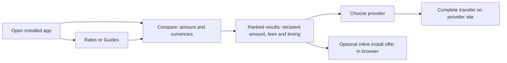

# PWA design and conversion review

Reviewed 29 September 2026. Changes are implemented locally; conversion uplift has not been measured.

## Goal and flow

The primary conversion is a useful comparison followed by a provider visit. Installation supports a later visit. Completed transfers require provider-side attribution; an outbound click does not establish a completed transfer.

## Findings and changes

| Priority | Finding | Implemented change | Reason to measure |
|---|---|---|---|
| High | Returning app users landed on the editorial homepage | Manifest starts at `/send-money`; app navigation exposes Compare, Rates and Guides | Fewer steps to the core task |
| High | A timed install overlay could interrupt the form | Offer now occupies an inline slot after results or article content, with engagement and visibility checks | Protect comparison completion |
| High | Introductory content delayed the comparison | Shortened heading and subtitle; moved author details below the tool | Bring inputs and results closer to the first screen |
| High | Sponsored placement preceded the ranked answer | First comparison card comes before the clearly labelled sponsor | Answer the user's search before presenting the promotion |
| Medium | Installed view retained competing floating controls | Hide secondary scrolling and WhatsApp chrome inside the app | Reduce competing actions |
| Medium | Offline notice covered page content | Notice occupies document flow and remains below app navigation | Make status and next action visible |
| Medium | Install wording implied a download | Use “Install app,” explain the shortcut and platform-specific action | Set accurate expectations |
| Medium | Install controls were small | Use 48px install, close and dismiss controls | Improve touch use |

The existing sort order still determines the first comparison card. Sponsored placement does not change ranking, and it is omitted when that provider already occupies the first card.

## Content and placement rules

1. Keep the comparison heading short: “Compare money transfers.” Follow with the practical promise: “See what arrives after fees. Choose a provider to complete your transfer.”
2. Put amount and currencies before education, installation or community promotion.
3. Keep recipient amount, fees, exchange rate, timing and the provider action together. Preserve distinctions between estimates and executable quotes.
4. Present the ranked answer before the sponsor; retain the Sponsored label.
5. Offer installation after useful content. Keep explicit installation available through the existing browser header/menu. Do not prompt while an input is focused, a dialog is open, consent is unresolved, or the browser is offline.
6. Retain review authorship and methodology below the working tool. Keep provider reviews and high-value guidance reachable for decisions that need further research.
7. Explain offline limitations. A saved page is not evidence of a current quote or an ability to complete a transfer offline.

The install placement follows the principle of promoting installation at relevant, engaged moments in [web.dev's installation guidance](https://web.dev/articles/promote-install). The specific placement here is a product hypothesis, not a guaranteed conversion improvement.

## Measurement plan

| Question | Measurement |
|---|---|
| Does the shorter comparison flow help? | Sessions with `provider_clicked` after `quotes_viewed`; report separately by corridor, amount band and `display_mode` |
| Are searches completing? | Sessions with `quotes_viewed` after `compare_search`; separate automatic initial results from explicit searches |
| Is installation helpful? | `pwa_install_prompt_shown` → `pwa_install_clicked` → `pwa_installed`, segmented by placement and platform |
| Do installed users return and compare? | `pwa_launched` followed by comparison and provider events; deduplicate by session |
| Does sponsor placement undermine the comparison? | Track sponsor events separately from ranked-result clicks, with task completion and abandonment as guardrails |

The three comparison events now carry explicit display mode; install impressions carry placement. Existing installation click events identify their surface. Platform install acceptance and first installed launch remain distinct signals.

Before declaring a winner, establish baseline conversion and traffic, define the smallest worthwhile change, and calculate the required sample size. Compare equivalent corridor/device cohorts or use a randomized experiment. Do not infer success from install counts alone. Respect existing analytics consent; do not treat missing events as abandonment without checking consent and instrumentation.

## Validation and limitations

- TypeScript compilation passed.
- PWA asset validation passed (icons, screenshots and shortcuts).
- Targeted lint passed; the existing comparison component has pre-existing image and unused-code warnings.
- Browser coverage exercises Chromium installation, dismissal/snoozing, unsupported browsers, installed launch attribution, iOS/macOS instructions, inline placement, installed navigation, sponsorship and connectivity messaging.
- Native iOS/macOS behavior is simulated in Chromium; physical device installation remains a release check.
- Browser checks use an isolated development preview with the application routes/components and explicit locale rewrites. The normal local middleware exhibits a redirect loop, so these checks do not validate production middleware or service-worker caching. No service-worker code changed.
- Existing rates-page duplicate currency-key warnings and a missing optional API credential appeared in the local preview.
- Live baseline images are in this directory. After images use the local preview, so monetary figures are not a controlled before/after comparison.

### Final browser results

33 targeted scenarios passed across the runs: 24 install/platform scenarios, eight conversion-flow scenarios (four each on desktop and Android-sized Chromium), and one manifest/assets scenario. Initial failures were corrected by making placement tests scroll to the inline offer after page content settled and by waiting for navigation during cold development compilation. This is targeted interaction coverage, not the full production/offline suite.

### Responsive evidence

All eight viewport/mode combinations had no document-level horizontal overflow. Coordinates below are CSS pixels from the top of the page, at a viewport height of 844px. They describe layout, not measured conversion performance.

| Width | First result, browser/light | First result, installed/dark |
|---|---:|---:|
| 320 | 676 | 732 |
| 390 | 626 | 682 |
| 768 | 634 | 690 |
| 1440 | 475 | 531 |

- [Mobile browser](after-390-browser-light.png)
- [Mobile app](after-390-app-dark.png)
- [Narrow mobile](after-320-browser-light.png)
- [Desktop app](after-1440-app-dark.png)
- [Measurements](layout-measurements.json)

The development indicator is hidden in the after screenshots. No production build, deployment, real money transfer, or live analytics experiment was performed for this review.

## Install banner follow-up: homepage, guides and business

The follow-up scope is specifically PWA installation, not a redesign of the page content. The banner now uses a shared responsive layout, app icon, clear benefit, green primary action and a 48px “Not now” control. Its wording reflects the current page; it does not promise offline transactions, saved shortlists or account features.

| Surface | Banner placement | Message focus |
|---|---|---|
| Homepage | After the dynamic comparison section | Returning to comparisons |
| Guides hub | After featured reading, before the library | Guides, rates and the next payment |
| Standard guides | After the main article sections | From research to comparison |
| All five research guide routes | End of the shared research article | Returning to research and comparisons |
| Business hub | After the cost benchmark | Business payment research |
| Business guides | After the article, before FAQs | Keeping guides within reach |
| Business comparison | After the interactive finder | Comparing payment options |

One manager still owns the offer across all surfaces: engagement and visibility gating, browser capability, consent, offline suppression, once-per-session display and dismissal persistence. The manager watches page-specific and fallback slots, offers only once per session, and retries when an input or dialog no longer blocks it. It can offer at the fallback if the earlier slot was passed before the engagement delay. Placement is carried into impression and install-click events.

The platform flow remains: native install prompt when available; explicit Home Screen instructions for iOS; Dock instructions for Safari on macOS. Existing app users do not receive the banner. The header/menu keeps an explicit install entry point.

The nonblocking placement and remembered dismissal follow [web.dev's PWA promotion guidance](https://web.dev/articles/promote-install). These design changes are not evidence of increased installs or completed transfers.

### Follow-up verification — 30 September 2026

The banner rendered without horizontal overflow at 320, 390, 768 and 1440px. Placement checks passed on desktop and Android-sized Chromium for all seven representative route types. Light/dark screenshots: [mobile](banner-320.png), [mobile dark](banner-390.png), [tablet guides](banner-768.png), [desktop business](banner-1440.png).

The workspace subsequently received committed PWA fixes through `4d58bdad4`, including rechecking offers after a quick scroll or a focused input leaves the screen. Vercel reports success for that commit. Live HTTP checks returned 200 and confirmed the new slot on the homepage, `/guides` and `/business`. This supersedes the earlier local-only deployment status; this review did not initiate that deployment.
